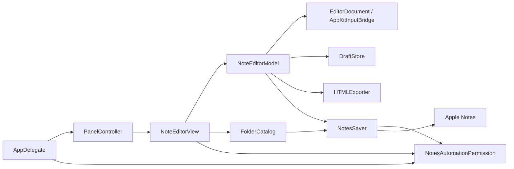
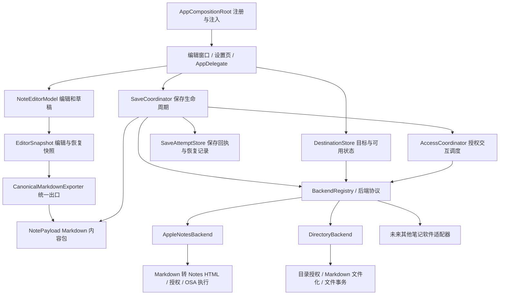
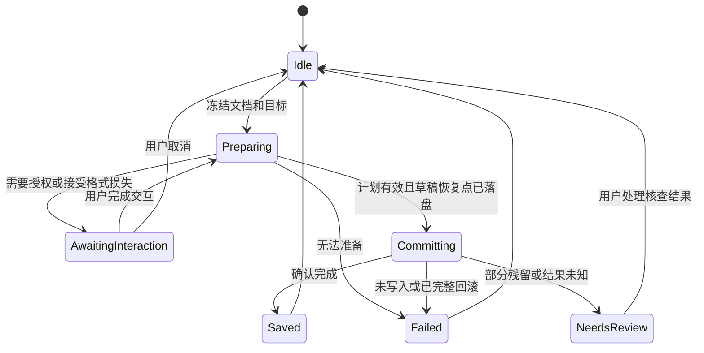

# NotesMate 多后端保存架构方案

状态：**已按用户确认的产品方向修订，尚未实施**。调研日期：2026-09-25；代码基线：`main / 6a11f8d`。本次修订依据见第 13 节。

本轮只维护方案文档。以下明确区分已存在的实现、已确认的产品方向、技术建议和后续验证项；不把设计中的接口视为已实现功能。

## 1. 建议结论与范围

保留现有语义编辑器和本地草稿，以 **统一保存服务 + 后端适配器 + 独立授权流程** 替代 UI 对 Apple Notes 的直接调用。系统备忘录成为第一个适配器，指定目录成为第二个适配器；后续笔记软件按其实际接口接入。

编辑器通过统一出口生成固定的 **Markdown 内容包（正文 + 附件 + 元数据）**，后端写入适配器据此转换、裁剪为目标接受的格式。语义文档继续服务编辑和草稿恢复，但不进入后端公共契约。保存位置使用带后端实例身份的不透明引用，而非假设所有软件都有“账户／文件夹”。权限只统一状态与交互调度，实际授权机制归各适配器负责。

建议首轮实施范围：

- 抽离 Apple Notes 的权限、目录、内容转换、写入、校验与回滚，保留现有编辑能力。
- 接入一个真实的“指定目录”后端，验证抽象确实能适应不同授权与数据链路。
- 增加设置页；首次安装启动后引导选择后端、完成授权并配置保存位置。既有安装迁移原 Notes 配置。
- 一次保存到一个目标，记录各后端最后选择的位置；编辑草稿在后端之间共享。
- 位置失效时尽量在既定范围内回退；成功告知实际位置及回退事实，失败明确提示并保留未保存草稿。“打开”快捷键随当前后端打开笔记应用或 Finder 目录。
- 使用应用内编译注册的适配器，不引入动态插件加载、第三方代码执行或依赖注入框架。

后续范围：具体笔记软件适配、多目标同时保存、离线自动重试队列、笔记浏览／搜索／同步／编辑远端旧笔记。此次“读取目录”指发现可保存的位置，不扩展为读取所有笔记内容。

## 2. 当前实现梳理

### 2.1 组件和调用路径

| 层次 | 当前实现 | 实际职责与耦合 |
| --- | --- | --- |
| 应用入口 | [NotesMateApp.swift](../NotesMate/NotesMateApp.swift)、[AppDelegate.swift](../NotesMate/AppDelegate.swift) | accessory 应用、菜单栏、全局快捷键、登录启动；同时直接探测／请求 Notes 自动化权限、打开 Notes、设置目录选择器首次可用状态 |
| 浮窗 | [PanelController.swift](../NotesMate/PanelController.swift) | 持有长期存活的 `NoteEditorModel`，创建 NSPanel、焦点／置顶／位置／大小管理；目前在内部直接构造 model 和 view |
| 视图 | [NoteEditorView.swift](../NotesMate/Views/NoteEditorView.swift) | SwiftUI 工具栏与原生菜单；持有 `[NotesFolder]` 和目标，加载目录、过滤废纸篓、回退失效目录、解释 AppleScript 错误、打开权限设置、更新保存成功状态 |
| 编辑协调 | [NoteEditorModel.swift](../NotesMate/Editor/NoteEditorModel.swift) | 编辑操作、提示、草稿恢复／防抖持久化；直接导出 `NotesSaver.NoteContent`，执行 Notes 类型的 writer，按 revision 决定是否清空 |
| 编辑内核 | [EditorDocument.swift](../NotesMate/Editor/Core/EditorDocument.swift)、[AppKitInputBridge.swift](../NotesMate/Editor/AppKit/AppKitInputBridge.swift) | Foundation 语义模型 + Reducer + TextKit 投影；段落、行内格式、图片 Data、顺序和 revision 已有独立表示，是解耦的基础 |
| 草稿 | [DraftStore.swift](../NotesMate/Editor/Persistence/DraftStore.swift) | `draft-v1.json` 原子信封，内含文档／原始图片／空稿输入格式；串行队列和 generation 抑制旧写入，兼容旧 RTFD，不依赖 Notes |
| 内容导出 | [HTMLExporter.swift](../NotesMate/Notes/HTMLExporter.swift) | 从模型生成 HTML 与图片出现顺序；HTML 内用 `NotesMateImage` 占位符，为 Notes 写入流程服务 |
| 目录与偏好 | [FolderCatalog.swift](../NotesMate/Notes/FolderCatalog.swift) | AppleScript 枚举账户文件夹、解析制表符结果，同时持久化所选目录与选择器可用性；通过 `NotesSaver.runScript` 执行 |
| 写入 | [NotesSaver.swift](../NotesMate/Notes/NotesSaver.swift) | OSAKit 脚本执行、图片 PNG 临时文件、建笔记、追加附件、回读校验、失败回滚、默认目录回退；还读写权限和目标全局状态 |
| 权限 | [NotesAutomationPermission.swift](../NotesMate/Notes/NotesAutomationPermission.swift) | TCC Apple Events 检测及请求，识别 `-1743`／`-1744`，用 UserDefaults 缓存菜单提示状态 |



### 2.2 保存与授权的真实行为

1. `send()` 防止空内容、输入法组字中和重复保存。`exportContent()` 在调用线程生成 HTML，把图片 Data 转为 `NSImage` 数组。
2. `saveAsync()` 捕获内容和 revision，进入静态串行 `NotesMate.save` 队列。目标目录未与内容一起捕获，由 writer 执行时的 `FolderCatalog.target` 默认参数取得。
3. 纯文字通过一次 `make new note` 获得 ID，不传 `name`，标题交给 Notes 派生。自定义目录遇 `-1728` 时清除选择并重试默认目录。
4. 有图片时，先创建去除图片占位符的正文，再逐张创建附件并替换完整正文；导出附件比较 PNG 数据。默认最多 20 次验证，同时检查 8 秒窗口，但每次脚本自身还有 5 秒 timeout，因此 8 秒不是严格总超时。
5. 后续失败且已知 note ID 时尝试删除刚创建的笔记；创建结果不明或回滚失败时保留临时图片，附带提示。成功结果只有 `.success`，没有向上返回笔记 ID、实际目标或警告。
6. 回到主线程，仅当成功且 revision 未变才 `clear()`；保存期间的新编辑被保留。失败保留草稿。`clear()` 的输入格式行为来自现有 draft-created hooks，应作为回归项保留，不在后端重构中改写。
7. 新安装先隐藏目录选择器，第一次保存成功后才枚举目录；旧安装通过 `didShowFirstLaunchEditor` 迁移可用性。启动／激活时只在 Notes 已运行时探测权限；显式“授权”动作会后台启动 Notes 并请求权限。

### 2.3 需要解决的结构问题

- **内容类型依赖方向相反。** 编辑器依赖 Notes 的输入／结果类型，无法自然输出 Markdown 或远端 block 数据。
- **全局偏好参与正在进行的操作。** 内容快照与目标并非同一事务，未来允许切换后端时可能写往点击时之外的目标。
- **目录模型不够通用。** `NotesFolder` 只有 ID、名称和账户名，没有父子关系、可写性、分页完整性。UI 按账户名称分组，并按中英文名称过滤废纸篓。
- **授权缓存与真实权限混用。** `runScript()` 任意脚本成功都会记录授权成功，即使该脚本没有访问 Notes；目录读取也借用“保存器”执行。
- **错误语义太弱。** `.failed(String)` 混合无副作用失败、已回滚、部分残留和创建结果未知，UI 无法决定能否安全重试；保存遇 `.unauthorized` 时还丢弃了其携带的详细信息。
- **异步目录结果缺乏身份校验。** 目前刷新没有 request generation，迁移到多后端后，旧响应可能覆盖新选择。
- **显示逻辑包含产品规则。** 授权说明、欢迎语、保存状态、快捷键和错误标题都写死 Notes；目录失效回退也散落在视图和 saver 两处。

以上是代码结构与潜在故障路径的判断，不代表本轮已复现所有竞态。旧设计文档可供背景参考，当前行为以源码为准，例如当前列表支持八级，而早期设计稿记录过三级。

## 3. 目标架构与依赖方向



核心边界：

- `Editor/Core` 只表达内容，不认识目标、权限、AppleScript、路径或网络。
- `NoteEditorModel` 负责编辑和草稿，提供不可变快照及“成功后有条件清空”；不执行具体后端写入。
- `CanonicalMarkdownExporter` 将同一编辑快照生成确定性的 Markdown 内容包；`MarkdownCodec` 解析统一方言。各后端消费内容包及其解析结果，不直接遍历 `EditorDocument`。
- `DestinationStore` 在主线程发布选中实例／位置、连接状态和目录加载状态，统一持久化选择。
- `SaveCoordinator` 负责防重复、快照冻结、授权调度、预检、确认格式损失、有限回退、提交、回执及清稿条件。适配器提出候选位置并报告副作用状态，不操作编辑器或草稿。
- `AccessCoordinator` 保证同一时刻只显示一个授权交互，并处理窗口／焦点／提示阻塞；具体授权策略、系统调用及 provider 专属界面由适配器组件提供。
- `BackendRegistry` 管理内置工厂和已配置实例，只在组合入口知道所有具体适配器。视图不得出现 `switch backendID` 分支。

首版沿用一个 Swift Package library 和 Xcode app target，通过目录、protocol 和注入建立边界；无需先拆成多个独立 package。

## 4. 通用领域模型

### 4.1 后端类型、实例和保存位置

| 概念 | 示例 | 设计约束 |
| --- | --- | --- |
| `BackendKindID` | `apple-notes`、`directory` | 稳定机器 ID，不使用翻译后的名称 |
| `BackendInstanceID` | 一个 Notes 连接、一个授权目录、未来一个远端 workspace | 同类可有多个实例；首版 Notes 可用单实例聚合系统账户 |
| `DestinationRef` | 某实例中的默认位置或具体目录 ID | 包含 instance ID；不透明 ID 仅由所属适配器解释 |
| `DestinationNode` | 账户、文件夹、数据库、标签集合等 | ID、parentID、显示名、分组名、是否可选；分组节点可以不可保存 |
| `DestinationPage` | 一页子节点及 next cursor | 区分部分列表和完整列表；不能因本页未出现某 ID 就认定目标被删除 |
| `DestinationSelection` | 当前选中实例及位置 | 每个实例分别记忆最后选择，UI 名称仅作缓存，不能充当身份 |

明确区分 `.backendDefault` 和 `.resource(opaqueID)`；“尚未配置”属于状态，不用 `nil` 同时代表这些不同含义。只有声明支持默认位置的后端能接收 `.backendDefault`。目录后端的实例根目录已经是一个明确资源，无需假造一个系统默认目录。

通用位置浏览支持层级与分页，但首版目录后端只管理用户主动添加的目录，不递归扫描整块磁盘。Apple Notes 当前返回扁平列表，第一阶段如实呈现；嵌套文件夹覆盖、同名账户身份与特殊目录识别需专项验证，不能通过抽象升级就声称已经解决。

### 4.2 固定 Markdown 内容包与编辑快照

```swift
// 接口轮廓；下文辅助类型需要在实施时定义，不是可直接编译的补丁。
struct NotePayload: Sendable {
    let formatVersion: Int              // NotesMate Markdown v1
    let draftID: UUID
    let revision: UInt64
    let markdown: String
    let assets: [UUID: NoteAsset]        // Data、媒体类型、尺寸
    let suggestedTitle: String?
    let sourceIssues: [ExportIssue]     // 统一出口已发生的规范化／损失
}

struct SaveRequest: Sendable {
    let operationID: UUID
    let payload: NotePayload
    let destination: DestinationRef
    let configurationRevision: UInt64
    let fallbackPolicy: FallbackPolicy  // 点击保存时冻结范围与次数
}
```

编辑侧仍捕获原始 `EditorDocument` 和输入状态，用于恢复与清稿判断；统一出口在该不可变快照上工作。实施时为跨线程值类型补齐合适的 `Sendable` 声明，而非对 AppKit 对象使用未经验证的 `@unchecked Sendable`。后端附件使用独立的 `NoteAsset` 值类型，不传递 `NSImage`、编辑器对象或临时文件路径。

建议将固定格式定义为版本化的 **NotesMate Markdown v1**，统一出口不随当前后端变化：

- 正文使用明确限定的 Markdown 语法表示段落、三级标题、粗体、斜体、代码、列表及图片；删除线使用 `~~...~~` 扩展。
- 为保留现有编辑能力，约定有限的 HTML 扩展：`<u>` 表示下划线，`<br>` 表示必要的换行，受限 `<span>` 属性表示字号／等宽意图。编码、嵌套规则与允许属性须在 P1 固定并测试，不能接受任意 HTML 透传。
- 图片用 `` 引用包内资产；同一图片可重复引用。目录适配器将引用转换为相对文件路径，Notes 适配器转换为其附件写入载荷，远端适配器可转换为上传后的资源引用。
- 正文是唯一的后端内容来源，附件是独立二进制资源。元数据不再夹带一份 `EditorDocument` 供适配器绕过 Markdown 取内容。
- 统一出口无法完整表达的编辑信息必须进入 `sourceIssues`；适配器的格式转换／裁剪再追加问题，保存服务合并展示。原始编辑文档始终保留在草稿／恢复快照中，不用有损导出的 Markdown 反建草稿。

`MarkdownCodec` 为各适配器提供同一方言的解析结果，避免每个后端各写一套 Markdown 正则替换。解析 AST 只是内容包的派生值，不增加第二份可变正文；不复用编辑器 AST 作为后端入口。P1 必须验证“编辑器 → 固定 Markdown → Notes HTML”的结构与图片顺序不退化，再迁移正式写入链路。此方言是内部交换约定，不承诺外部 Markdown 阅读器都能保真显示其扩展。

标题只作为建议值：取首个有意义的文本段，纯图片使用本地化缺省标题；Apple Notes 保持不传 `name`。文件名另行做字符／长度清理，不能把清理后的文件名覆盖正文。

### 4.3 能力与格式损失

`BackendCapabilities` 描述位置选择方式、打开目标能力、结果确认程度，以及内容支持情况；它不是单个 `supportsRichText` 布尔值。需区分标题、列表层级、行内样式、原位图片、附件大小／数量限制、显式标题等。

静态 capability 用于 UI 展示；真正能否保存由当前实例、目标和内容包的预检决定。预检合并统一出口与适配器转换的 `ExportIssue`：`blocking` 或 `lossy`，带稳定 code 和本地化参数。裁剪的是输出，不是编辑器原稿。

- 不支持图片时，不得静默丢图；默认阻止保存，提供换目标／格式的操作。
- 下划线、字体大小等目标格式无法表达时，在写入前列出损失；接受只针对当前快照、目标及导出配置。
- 接受降级不会更改编辑草稿。预检后只要目标或导出配置变更，必须重新生成计划；写入期间的新编辑留在下一份草稿。
- Apple Notes 导出已有的规范化行为先保持兼容并明确说明；新增后端不宣称逐像素保真。

## 5. 后端契约

推荐一个必要的 writer 契约与按需提供的服务，避免要求每个后端都实现无意义的目录树、登录和打开动作。

```swift
protocol NoteBackend: Sendable {
    var descriptor: BackendDescriptor { get }

    func accessStatus(for intent: AccessIntent) async -> AccessState
    func prepare(_ request: SaveRequest,
                 at destination: DestinationRef) async throws -> PreparedSave
    func commit(_ plan: PreparedSave) async -> SaveOutcome
}

protocol DestinationCatalog: Sendable {
    func list(parent: DestinationRef?, cursor: String?) async throws -> DestinationPage
    func validate(_ destination: DestinationRef) async throws -> DestinationValidation
}

protocol FallbackResolver: Sendable {
    func candidates(for request: SaveRequest,
                    failure: BackendFailure) async -> [FallbackCandidate]
}

@MainActor
protocol BackendInteraction {
    func perform(_ action: BackendActionID,
                 context: InteractionContext) async -> InteractionResult
}
```

注册项包含 backend、可选 catalog、fallback resolver 和 interaction handler。首次 `prepare` 传入请求原目标，回退时显式传入策略允许的候选目标；适配器验证实例与作用域匹配。候选发现只读且不弹窗，发现失败时保留原因供最终错误说明。`BackendActionID` 是适配器声明的稳定动作，附带本地化标题与通用展示角色，如连接、重新授权、选择位置、打开位置、查看已保存内容。UI 将动作转回注册项执行，不自行解释 Notes bundle ID、OAuth URL 或书签。

契约规则：

1. `accessStatus` 不弹窗、不主动唤起未运行的目标软件；无法探测时返回未知／需连接，不能伪装已授权。
2. `prepare` 不产生目标端写入、不触发交互；验证内容包版本、附件引用和目标，将固定 Markdown 转为本后端格式，生成精确的格式问题及提交计划。必要的授权／登录必须先通过用户发起的交互完成。
3. `PreparedSave` 包含计划 ID、operation ID、实际目标、配置版本、格式问题和适配器私有载荷引用。私有载荷可由实例内缓存保管，不向公共层泄露任意 `Any`、AppleScript 或 token。计划须有丢弃／过期清理机制。
4. `commit` 只能消费所属实例的计划，不再读取“当前选中目标”。权限撤销或配置失效时返回结构化结果，不能改投其他后端。所有取消、异常和超时都必须映射到准确的副作用状态。
5. `prepare` 是时间点检查，不能消除检查后目标被删除的竞态；提交仍负责最终验证和结果分类。
6. catalog 的失败同样用通用错误表达，包括访问被拒、服务不可用等；绝不将失败转换为空列表。
7. 位置无效时由适配器提供有序 `FallbackCandidate`（目标、原因、所属授权范围），协调器按冻结的回退策略选择并重新 `prepare`。原 plan 不能在 `commit` 内偷偷改写目标；失败结果必须说明是否确定未写入，供协调器判断能否继续。

`PreparedSave` 不承担跨进程恢复，重启后根据保存记录进行核查。首版不持久化任意内存计划或自动重新提交。

## 6. 权限与连接状态

建议将“连接是否可用”与“访问权是否足够”分开，避免把应用未安装、网络断开和未授权都显示为权限问题。

| 维度 | 状态例子 | 对保存的影响 |
| --- | --- | --- |
| 可用性 | available / appMissing / offline / configurationInvalid | 提供安装、重连或修改配置动作；不自动触发权限弹窗 |
| 访问权 | unknown / notRequired / authorized / interactionRequired / denied | 对当前 intent 判断；授权信息缓存只是提示，真实操作仍可能被拒 |
| 授权交互 | idle / presenting / completed / cancelled | 同一时间一个交互；用户取消保留草稿与原目标 |

`AccessIntent` 至少区分发现位置和创建笔记，并携带目标作用域。未来同一远端账户可能有读取权限而无某个位置的写入权限，不能用全局 `authorized: Bool` 表示。

### 6.1 Apple Notes

- 把现有权限帮助器改成实例注入的 `AppleNotesAccessController`，将偏好缓存与 TCC 查询分离。
- `AppleScriptExecutor` 仅执行脚本并返回原始错误；Notes 适配器根据确实访问 Notes 的操作更新状态，目录读取不再调用 saver。
- 首次启动展示配置引导，用户选择 Notes 并点击连接后才启动 Notes、请求自动化授权；连接成功即可读取目录供配置使用，不再要求先保存一条笔记。仅打开设置页或后台刷新不索要授权；旧安装沿用迁移策略，显式连接操作可解除旧目录加载门槛。
- 将 `-1743`／`-1744` 映射为访问问题；应用不存在／无法启动另行处理。TCC 状态探测及 `askUserIfNeeded` 的实际系统行为需要签名 app 验证。[Apple 授权检测 API](https://developer.apple.com/documentation/coreservices/3025784-aedeterminepermissiontoautomatet)

### 6.2 指定目录

- 使用 `NSOpenPanel` 选择可写目录，创建 app-scoped security-scoped bookmark，持久化书签引用而非只存路径。
- 恢复时解析书签；stale 但可解析时刷新书签并落盘，无法访问时提供重新选择。每次操作由适配器持有访问作用域，正常／异常／取消路径都配对释放。
- 书签解析成功不等于卷在线或目录可写；需区分书签失效、磁盘离线、只读目录、空间不足等错误。后续失败不能要求用户去 Notes 自动化设置。
- 当前 entitlement 只有 user-selected **read-only**；目录写入阶段改为 **read-write**，并配置 app-scoped bookmark 能力。两种 user-selected entitlement 不应同时保留。[Apple 沙盒 entitlement 说明](https://developer.apple.com/library/archive/documentation/Miscellaneous/Reference/EntitlementKeyReference/Chapters/EnablingAppSandbox.html)

书签恢复后需显式管理 security-scoped access，这是跨启动持续访问目录的基础；书签内容只留在本机应用容器。[Apple 文件访问说明](https://developer.apple.com/documentation/security/accessing-files-from-the-macos-app-sandbox)

### 6.3 未来其他笔记软件

| 接入方式 | 适配器内部职责 | 通用架构的约束 |
| --- | --- | --- |
| 文件目录／vault | 文件格式、目录布局、附件引用、打开方式 | 可组合 DirectoryBackend 的授权和文件事务，不假设通用目录格式就完全兼容某产品 |
| AppleScript | 目标 app、脚本字典、TCC 与静态 entitlement | 复用 executor，但权限以目标应用为作用域 |
| HTTP API | 登录、token 刷新、分页、上传、限流、远端回执 | 凭据放 Keychain；普通配置只存引用；接入时再增加所需网络 entitlement |
| URL scheme／交接导入 | 编码请求、启动外部 app、回调关联 | 若只能证明已交接，不能返回已保存成功并自动清空草稿 |

这是接入分类，不是对任何具体第三方产品当前 API 的支持承诺。选定产品后先核对官方接口和沙盒可行性，证明最小写入闭环，再决定适配方式。适配器注册不意味着能在运行时任意扩展签名中的权限。

## 7. 保存事务、重试和草稿安全

### 7.1 保存状态机



执行顺序：

1. 主线程检查可发送、组字状态和当前保存状态；捕获 `draftID + revision + document + destination + configurationRevision + operationID + fallbackPolicy`，由统一出口生成固定 Markdown 内容包。同一编辑会话最多一个活动保存。
2. 查询访问状态，需要时通过 AccessCoordinator 显式交互。交互成功只继续当前用户发起的请求；后台刷新绝不自动触发保存。
3. 预检并准备计划；目标失效时按第 7.5 节解析回退候选并重新预检。存在格式损失时让用户选择继续、换目标或取消，不自动丢附件。
4. 在任何目标副作用前，持久化本次原始编辑快照、固定内容包及 attempt 记录；记录失败则停止提交。它与持续更新的活动草稿分开，避免用户后续编辑覆盖唯一恢复来源。每次回退提交也先记录实际目标与子尝试 ID。
5. 提交并处理确认／校验／必要的适配器内部补偿。提交后先持久化回执，再由 model 判断当前 `draftID + revision` 是否仍匹配，匹配才清空并落盘；否则保留新编辑。
6. 成功提示使用回执中的实际目标；发生回退时明确提示原位置失效及最终保存位置。失败说明原始错误、已尝试的回退及恢复方式，不清除未保存草稿。更新目录只作用于该实例。

建议首版保存期间禁用后端／位置切换，编辑仍可继续。即使 UI 禁用，底层仍必须冻结目标，防止后台设置更新或未来 UI 改版破坏正确性。

### 7.2 结果必须说明副作用

```swift
enum SaveOutcome: Sendable {
    case saved(SaveReceipt)
    case notSaved(BackendFailure)       // 明确未创建；或完整回滚已确认
    case needsReview(SaveUncertainty)   // 可能创建、部分残留、仅交接成功
}
```

`SaveReceipt` 至少包含 operation ID、最初请求的 destination、实际 destination、回退原因／路径、后端资源引用、确认级别、警告和可选打开动作。`BackendFailure` 包含分类 code、失败阶段、底层诊断、已尝试的回退、恢复动作和重试建议。`SaveUncertainty` 包含已知资源引用、残留附件／临时路径、核查动作及原始错误。

确认级别不能混淆：本地文件已提交、Notes 创建返回且图片回读通过、远端 API 确认与“已交给另一个 app”不同。只有满足该后端约定的保存确认才走 `.saved`。Notes 回读成功不代表 iCloud 已同步到其他设备；目录提交成功不代表云盘已上传。

### 7.3 重复与取消

- 超时或连接断开可能发生在目标已经创建之后；默认不自动重试创建，也不自动改投其他后端。
- 已知无副作用或完整回滚后允许用户重试；保留 operation ID 和完全相同的内容包／目标。第 7.5 节的自动回退在同一 operation 下增加子尝试 ID 并记录新实际目标；用户主动更改内容或目标时视为新操作。
- 支持可靠幂等键的后端可以利用 operation ID；Apple Notes 当前没有已验证的创建幂等机制，不能承诺 exactly-once。
- 预检阶段可安全取消。进入提交阶段后“停止等待”不等于撤销；AppleScript 已发送的操作可能继续完成，需收集结果或标为待核查。
- 适配器内部有限重试只用于确认安全的步骤，例如当前图片回读。第二次创建仅允许发生在确定前一次无副作用／完整回滚，且符合第 7.5 节回退条件时，不能根据一个笼统错误码直接重建。

### 7.4 最小恢复记录，不实现自动发送队列

新增 `SaveAttemptStore`，存储版本号、operation ID、快照、冻结目标、状态、回执／不确定性。提交前有恢复快照；完成并清稿落盘后再清理该快照。只维护尚未收尾的记录，不长期归档所有笔记。

重启时遇到提交中记录，进入人工核查或适配器只读核查；没有证据就不自动重发。若目标已成功但回执持久化失败，也保留草稿并提示“可能已保存”，不能伪装成普通可重试失败。

这是比当前实现增加的崩溃恢复保障，会多写一份待保存快照；当前图片随 JSON 持久化的内存／磁盘成本需纳入大图测试。首版不同时重构资产存储。

### 7.5 尽量回退，并明确告知结果

用户已确认采用尽量回退策略。以下限定自动回退的顺序与边界，避免将“位置不存在”和“可能已经保存”混为一谈：

1. 回退针对目标位置失效，不把权限被拒、格式不支持、磁盘空间不足或未知提交结果都当作目录失效。原目标在预检中确定无效，或提交失败被确认未创建／已完整回滚，才可开始回退。
2. 候选顺序由后端提供并在设置中说明。Notes 优先尝试原账户可写的默认位置，再尝试该实例的系统默认账户默认位置；目录后端优先已授权且仍可访问的实例根目录。只使用当前实例既有授权范围，不自动改投另一笔记软件、另一个已配置实例或未经用户选择的磁盘目录。
3. 目录实例根目录本身已失效时，只有用户在设置中显式配置并授权的备用目录可用；没有候选则提示重新选择并保留草稿。首版根目录不默认向父目录、桌面或下载目录回退。跨账户 Notes 回退范围需在设置中清楚展示。
4. 建议每次保存最多两个不同的回退候选，去重并记录已访问位置，避免循环。每个候选都校验可写性、授权和内容能力；默认目录最终解析为具体位置后冻结，再生成新计划。格式损失确认绑定内容包摘要、实际目标及导出配置，目标变化后重新检查，不能复用不匹配的确认。需要新授权时由用户交互完成，不能后台不断弹窗。
5. 保存成功明确展示“原位置不可用，已保存到 {实际位置}”，同时提供打开目标。建议成功后把该实例的当前位置更新为实际位置，前提是其选择版本仍与本次请求匹配；设置页保留回退说明。回退失败不更新选中目标，展示失败原因，原稿继续保留。
6. 任何一次子尝试结果不明或有残留立即停止继续回退，进入 `needsReview` 并告知“可能已保存，请检查”，保留草稿与恢复材料。这是避免重复笔记的必要条件，并不将未知结果谎报为确定失败。

回退机制属于协调器策略，候选发现和副作用判断属于适配器。`SaveRequest.destination` 始终记录最初目标；每个新 plan 显式记录实际目标及回退链，因此有限回退不依赖 UI 后续的选择变化。

## 8. 两个首发适配器

### 8.1 AppleNotesBackend

内部建议拆为 `AppleNotesAccessController`、`AppleNotesCatalog`、`AppleNotesWriter`、`AppleNotesHTMLConverter`，共享注入的 `AppleScriptExecutor`。转换器从固定 Markdown 的解析结果生成 Notes 白名单 HTML，并裁剪 Notes 不支持的表示；不再直接读取编辑器模型。不必机械拆成大量独立文件，重点是职责和依赖可测试。

保留现有 OSAKit 后台执行、每次执行独立 language instance、图片顺序与重复出现、PNG 校验、已知 note ID 的删除补偿及恢复材料。所有脚本执行通过专用串行 executor，包括目录与保存，避免三条不同队列无序访问 Notes。

Apple Notes 专有的 HTML 占位符、临时文件 URL、attachment API 和脚本转义留在适配器内部。公共 HTML 工具仅保留纯转义／通用遍历等可复用部分。临时资源要跟随 operation 管理，确认成功或确认回滚后才清除；不确定结果保留，并提供清晰的检查与清理入口。

**目标失效按第 7.5 节尽量回退。** 目录查询与创建阶段分开分类：目录解析明确不存在可以提出默认位置候选；创建脚本的笼统 `-1728` 仍须结合失败阶段判断，不能直接当作“没有副作用”的证据。回退成功返回实际位置与警告，失败保留草稿，不再只返回没有位置信息的 `.success`。

### 8.2 DirectoryBackend

首版默认保存固定 Markdown；目录布局建议仍为 **Markdown + 图片子目录**，一个笔记一个普通目录。用户已确认统一格式方向，以下布局是技术建议：

```text
用户选定的根目录/
  2026-09-25_153000-想法-<operationID>/
    index.md
    assets/
      <assetID>.png
```

- 子目录名由时间、标题片段和完整 operation ID 构成，清理路径分隔符／控制字符并限制长度；不覆盖同名用户文件。图片扩展名从实际数据类型确定，示例只是 PNG。
- 相同 asset 的重复出现可引用同一资产文件，正文中保留每次出现的位置。Markdown 转义、软换行、代码块围栏和嵌套列表单独测试。
- 默认保留固定 Markdown 方言，仅把包内资产引用转换为相对路径。下划线、字号等扩展在外部阅读器的显示能力不保证一致；针对具体笔记软件需要纯 Markdown 或 HTML 时，在该适配器内转换／裁剪，并报告损失。HTML 不再作为应用通用出口的替代候选。
- 在选定根目录内创建 staging 目录，先写正文和所有附件并验证完整性，再在同一卷内以不覆盖方式提交目录。不能从系统临时目录跨卷移动后宣称原子完成。并发存在同名最终目录时拒绝覆盖并核查归属。
- staging 和最终目录都用 operation ID 标识；在应用内保存文件清单／摘要供核查。重试时不能仅凭路径存在就认定成功，必须验证本操作的文件内容。
- 不主动清理用户或第三方文件，只处理能确定属于本操作的 staging。异常退出留下的 staging 在下次连接该目录时核查；需要授权时等待用户操作。
- 首版成功语义是本机可访问文件系统上的完整提交。网络卷、文件提供者、云盘占位文件和严格断电持久性不是当然保证；需后续验证文件协调及提交语义，不把云端同步完成作为当前承诺。

选择“每笔一个目录”是为了附件与正文共同提交，代价是根目录不是平铺 `.md`。未来针对具体 vault 的平铺文件与共享附件布局另行设计，不能为了兼容猜测提前削弱事务边界。

## 9. UI、线程与配置

### 9.1 UI 改动

- 工具栏目标入口常驻，展示“后端名称 · 位置”；未连接时仍能进入配置，不能沿用首次保存后才显示整个入口的限制。
- 目标菜单列出已配置实例、位置选择以及“设置…”入口，设置页集中管理后端、授权、保存位置及回退范围。首版不需要通用配置表单生成器。
- 保存按钮、进度、成功提示、辅助功能文本改用当前操作的目标描述；成功后的“打开”由 receipt action 执行。
- 菜单栏打开项及 ⌃⌘O 随所选后端变化：笔记软件打开对应应用，目录后端打开 Finder 中配置的目录；菜单使用适合该后端的名称。保存回执上的“打开”则针对本次实际结果，包括回退后的位置。没有有效配置时快捷键进入后端设置，不误开上一条笔记。
- 授权菜单显示当前实例提供的动作；更改授权或切换实例不会清空编辑草稿。
- 保持 ⌃⌘N、浮窗位置／大小、置顶、图片插入、输入法、撤销和提示系统。授权面板及格式确认期间沿用 tip blocking 和焦点恢复机制。

所有新增或调整的用户可见文本必须同一变更补齐 `EditorLanguage.supported` 的全部 **15 种语言**，包括错误、恢复动作、菜单、状态、欢迎语、无标题占位和辅助功能。统一模板使用占位参数，后端名称／用户目录名作为值；不能通过拼接绕过完整句子的翻译。需改动的系统权限说明也检查各语言的 InfoPlist.strings。本文只是设计文档，不新增运行时 UI 字符串。

### 9.1.1 设置页与首次启动引导

复用同一套设置组件实现首次引导和后续配置；将当前 `NotesMateApp.Settings` 的 `EmptyView` 替换为真实设置入口，并由窗口协调器支持菜单栏应用主动打开设置。引导使用独立可交互窗口，避免跟随录入浮窗失焦关闭。

首次安装流程：

1. 展示欢迎和后端选择，首版提供 Apple Notes／指定目录；页面打开本身不请求权限。
2. 用户选定后点击连接：Notes 进入自动化授权并加载位置；指定目录显示目录选择面板，持久化书签。
3. 确认保存位置、默认使用的后端及回退范围；以权限和位置预检检查可用性，不为“测试连接”写入一条示例笔记。无法提前证明可写时如实展示状态，最终由真实保存确认。
4. 配置原子落盘后完成引导并打开录入窗口；移除新安装直接进入旧 Notes 欢迎语的路径。失败停留在对应步骤，提供重试，不标记配置完成。

建议提供“稍后设置”：用户仍可录入并自动保留草稿；点击保存时进入设置，配置完成返回编辑器，由用户再次点击保存，避免稍后自动提交已经变化的稿件。关闭／跳过引导不会假造一个已连接 Notes 后端。

持久化 `onboardingVersion` 与 `notStarted / deferred / completed` 状态。首次自动展示后被推迟，下次启动不反复强制弹出，未配置时通过目标入口和保存动作引导继续。设置页支持添加／移除实例、默认实例选择、位置选择、连接状态、重新授权和打开目标；移除实例不删除已保存笔记或编辑草稿。活动提交使用的实例在完成前不能移除。

### 9.2 并发规则

- model、DestinationStore、UI 与交互宿主在 MainActor；导出、文件 I/O 和 OSA 执行离开主线程。
- actor 方法不等于自动后台执行；同步阻塞的 OSA 调用仍需专门串行 DispatchQueue 与异步桥接，不能直接阻塞 MainActor 或任意协作线程。
- 列表请求绑定 instance ID、configuration revision 和 generation；返回时全匹配才发布。旧响应可缓存到旧实例，不能覆盖当前 UI。
- 即使使用 actor，也需明确防止 `await` 期间重入造成重复提交；operation 状态在发起异步调用前登记。
- 授权缓存、实例配置和恢复记录经各自 store 串行修改，不继续暴露可变 static defaults。

### 9.3 持久化与迁移

建议采用版本化 `BackendConfigurationStore`，持久化 instance 列表、kind、配置版本、active instance、各实例 last destination。配置中只存稳定身份和非敏感偏好；书签存本机容器内独立 store，远端凭据未来存 Keychain。

迁移步骤：

1. 没有新配置且检测到旧版使用记录（首次打开标志、旧后端偏好或旧草稿等）时，创建固定的 Apple Notes 兼容实例，沿用 Notes 选择；拷贝 `NotesMate.targetFolder.id/name/account` 为位置引用和显示缓存。全新安装没有旧记录时进入配置引导，不默认创建已配置实例。迁移已有配置的用户不被强制重走首次引导。
2. `NotesMate.folderSelector.available` 和旧首次打开标志仅迁移为 Notes 的自动目录加载策略，不阻止用户添加其他后端。
3. `NotesMate.notesAutomation.*` 只作为旧提示缓存参考，不写成永久授权事实；按实际操作重新确认。
4. 配置完整原子写入成功后才记录迁移完成；保留旧键以便旧版本读取，不维持长期双写。降级到旧版无法理解新后端，旧版仍用原 Notes 目标；此限制写入发布说明。
5. `draft-v1.json` 与旧 RTFD 迁移规则保持不变；增加会话 draft ID 和 attempt 记录不要求重写历史草稿。重启恢复时通过持久化身份／内容摘要对应活动草稿，不能仅比较进程内 revision。
6. 未识别的新配置版本／缺失 provider 要保留配置并显示不可用，不能悄悄重置为 Apple Notes。每次迁移幂等，失败保留原文件。

## 10. 文件落点和迁移顺序

建议目录（按职责列出，实施可合并小文件）：

```text
NotesMate/
  Editor/                         现有语义编辑器与 DraftStore
  Saving/
    Models/                       身份、快照、位置、能力、结果
    NoteBackend.swift             协议与注册项
    BackendRegistry.swift
    DestinationStore.swift
    SaveCoordinator.swift
    AccessCoordinator.swift
    BackendConfigurationStore.swift
    SaveAttemptStore.swift
  Backends/
    AppleNotes/                   脚本、目录、权限、HTML、writer
    Directory/                    书签、Markdown、文件事务
  Export/                         真正通用的纯内容工具
    CanonicalMarkdownExporter.swift
    MarkdownCodec.swift           固定方言解析与校验
  Views/Settings/                 后端设置与首次启动引导共用组件
  AppCompositionRoot.swift        构造依赖；正式 app / harness 分开配置
```

| 阶段 | 改动 | 完成门槛 |
| --- | --- | --- |
| P1：定义边界 | 新领域类型、固定 Markdown 方言／内容包、统一出口和 codec、fake backend、registry、注入入口；model 提供编辑快照 | Markdown 中间链路保留既有结构／图片顺序；fake 可驱动通用保存；后端不依赖 `EditorDocument` |
| P2：完整 Notes 适配 | 移入权限、目录、Markdown 转 HTML、executor；接入通用状态与结果；迁移旧配置、有限回退、冻结目标、恢复记录 | Notes 功能通过回归；回退有实际位置提示；目录与保存无全局目标读取；结果不明不自动清稿 |
| P3：指定目录、设置与引导 | security-scoped bookmark、内容包文件化、文件事务、设置页／首次引导、切换目标、动态文案与 15 语言 | 新安装可选任一后端；旧安装平滑迁移；沙盒 app 跨重启写入指定目录；不请求 Notes 权限；离线测试全绿 |
| P4：清理和签名验收 | 删除过渡桥和旧 static 调用；更新 README、harness、设计预览与发布说明 | UI/Model 对具体适配器零直接引用；签名 app 的 TCC／书签／图文保存矩阵通过 |
| P5：后续软件 | 选择一个具体产品验证接口，新增 provider 与专属配置／导出 | 只改适配器、注册、必要配置 UI／本地化和权限声明，不重写编辑器或保存状态机 |

构建入口必须同步处理：当前 [Package.swift](../Package.swift) 只纳入 `Editor` 与 `Notes`；[build-editor-harness.sh](../scripts/build-editor-harness.sh) 和 [capture-design-preview.sh](../scripts/capture-design-preview.sh) 同样固定扫描这些目录。新目录加入后应统一 source 集合，且组合入口的 app 专属代码不要误纳入纯测试模块。Xcode 使用同步目录组，也要验证文件 membership／资源排除仍正确。

测试宿主改为注册完整 fake backend，不只替换 writer：当前 harness 替换 writer 后，视图成功回调仍可能走真实目录加载，新架构应从注册入口彻底隔离 Notes 访问。`InlineSaveProbe` 保留为明确的真机集成入口，不能混入自动化单测。

## 11. 验证方案与验收标准

本轮没有改动可执行代码，也未运行测试或实际请求系统权限。以下为实施验收计划。

| 验证面 | 关键案例 |
| --- | --- |
| 编辑回归 | 现有 Core、AppKit、IME、Undo、空段格式、八级列表、图片顺序与重复图片；成功清稿的格式与历史规则 |
| 固定格式 | 同一快照对所有后端生成相同 Markdown 内容包；正文／附件引用完整；版本拒绝；扩展解析与转义；Markdown 转 Notes HTML 的结构回归；统一出口损失与适配器裁剪均可见，均不更改草稿 |
| 通用保存 | 后台不阻塞、重复点击只一次 commit、成功后新 revision 不被清空、快照目标不会漂移、配置失效拒绝旧计划 |
| 授权 | 首次引导展示不等于系统授权弹窗、显式连接才授权、拒绝／取消／撤销、Notes 不运行的未知状态、不同实例／intent 状态隔离 |
| 目录 | 多账户同名目录、分组不可选、分页不误判删除、旧响应不覆盖新选择、读取失败不清空选择、失效目标按确认策略处理 |
| 回退 | 原位置失效／首候选失败／后续候选成功；同账户与系统默认位置；候选去重与次数上限；无可用位置时保留草稿；成功显示实际位置；未知或残留立即停止；不跨实例／未授权路径；选择版本变化不被回执覆盖 |
| Notes 脚本 | 特殊字符转义、纯文本单次创建、权限错误不默认目录重试、图文位置、附件验证延迟／失败、删除补偿成功／失败、创建超时未知结果 |
| 目录文件 | Unicode／超长／冲突文件名、Markdown 围栏及转义、相对图片路径、同图多次引用、拒绝越界路径、只读／空间不足／目录被删除、staging 中断 |
| 书签真机 | 首次选择、退出重启后访问、目录移动／卷卸载／失效／重新授权；所有失败路径释放 scope |
| 恢复 | 提交前记录失败、创建后崩溃、回执写失败、回执成功而清稿前崩溃；重新启动不自动重复创建；保留期间的新草稿 |
| 不确定性 | partial／unknown／handoff 不显示普通成功、不清稿；核查动作携带正确操作和资源；授权错误仍展示恢复材料 |
| 迁移 | 无旧偏好、有效／失效旧目录、已有草稿、迁移中断后重启、未知配置版本、旧键保留 |
| 设置与引导 | 全新安装进入配置；两种后端连接；取消／跳过／继续；状态落盘失败；旧安装不重复引导；移除实例不删草稿；配置完成不自动发送；⌃⌘O 随后端打开应用／Finder，未配置进入设置 |
| 本地化与 UI | `testEveryCatalogIsCompleteAndPreservesParameters`，15 语言参数一致；最窄窗口、辅助功能、动态后端名称、快捷键与焦点 |

复用现有 `NotesSaverTests` 与 `AsyncSaveTests` 的场景，移动测试归属而非删掉关键覆盖；补充协议契约测试和 fake 适配器。文件事务测试只写独立临时目录，授权通过 fake 测试状态机，真实 TCC 和书签权限必须用签名沙盒 app 单独验证。

实施阶段运行 `bash scripts/test-editor.sh`、harness 构建和 Xcode app 构建。自动化测试不得枚举用户真实 Notes 目录或创建真实笔记；真机端到端验证用明确隔离的测试目录／笔记并记录结果，不用单元测试通过替代系统权限验收。

架构验收的可检查指标：`NoteEditorModel`、`NoteEditorView`、`AppDelegate` 中不再引用 `NotesSaver`、`NotesFolder`、`FolderCatalog`、`NotesAutomationPermission`；具体后端名称只出现在注册入口、适配器及资源中。目录后端从启动到成功保存不需要 Notes 运行或授权。

## 12. 主要取舍

| 选择 | 收益 | 成本／限制 |
| --- | --- | --- |
| 固定 Markdown 内容包作为契约 | 公共出口稳定，各后端独立转换／裁剪；后端不依赖编辑器模型 | 需定义方言与附件约定，增加解析步骤；必须验证现有富文本经中间格式不意外丢失 |
| 实例身份 + 不透明位置引用 | 支持多个目录／账户，阻止串目标 | 配置与迁移比一个全局 folder ID 略复杂 |
| 权限机制留在适配器，调度统一 | TCC、目录授权与登录可独立演进 | 需要明确 UI interaction 边界，不能只给一个 `requestPermission()` |
| 保存结果表达不确定性 | 不丢稿、不对未知提交盲目重试 | 用户偶尔需要手动核查，无法保证 Notes 恰好写一次 |
| 有限自动回退且告知结果 | 位置变化后尽量完成保存，用户知道最终去向 | 需记录候选、实际位置和副作用；所有回退失败或结果未知时保留草稿 |
| 一个笔记一个目录 | 正文附件共同提交，便于清理恢复 | 不满足所有软件的平铺 vault 布局 |
| 内置注册、单目标保存 | 控制首版复杂度，便于完整验证 | 暂无运行时插件、多目标广播、自动离线队列 |

## 13. 已确认的产品方向与技术默认

用户已确认以下方向，实施时无需再次询问相同选择：

| ID | 已确认方向 | 文档中的落点 |
| --- | --- | --- |
| D1 | 增加设置页，首次安装启动后引导用户配置后端；首轮按 Notes + 指定目录推进 | 第 1、9.1.1、9.3、10 节 |
| D2 | 应用输出固定格式，后端笔记写入适配器转换和裁剪为其他格式 | 采用固定 Markdown 内容包，见第 3–5、8 节；编辑模型保留在编辑／草稿边界内 |
| D3 | 目录失效时尽量回退，成功说明已回退，失败告知错误且不清除未保存草稿 | 第 7.5、8.1 节；未知提交结果保留草稿并核查，避免继续创建重复笔记 |
| D4 | 根据所选后端打开笔记应用或 Finder 目录 | 第 9.1 节；保存回执的打开动作定位本次实际结果 |

以下是为落地提出的技术默认，不冒充用户逐项指定的要求：Markdown 方言的有限扩展、每笔一个目录、引导可稍后设置、每次最多两个回退候选、回退成功后更新该实例的位置。其取舍分别记录于对应章节，可在实施细化时调整而不改变上述产品方向。

首个其他笔记软件尚未指定，可在完成两个首发后端后调研，不阻塞当前架构设计。后续实施按 P1–P4 分阶段推进，每阶段保持可构建和可回归；本次修订仍只更新方案文档。
