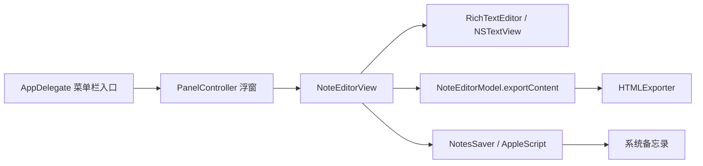
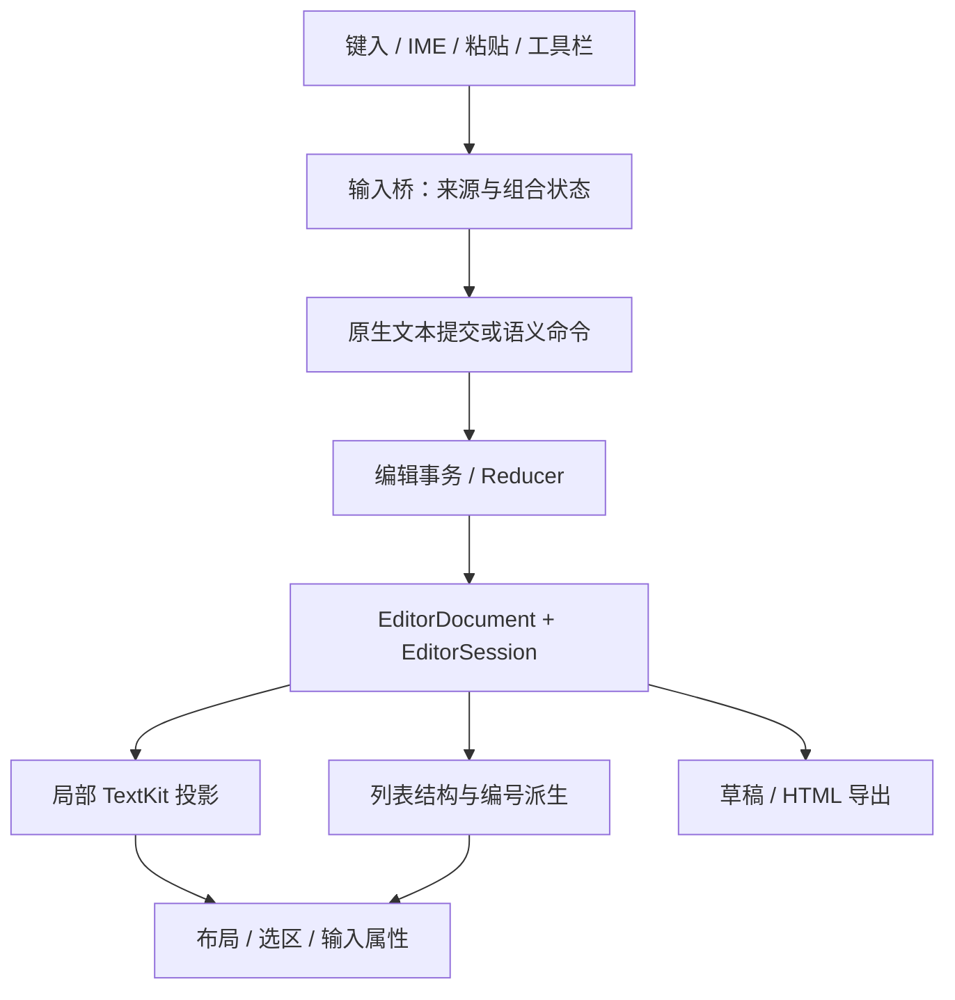

# NoteMenu 富文本编辑器设计方案

状态：已实施，2026-09-20。设计基于提交 `0655ecf` 的源码及 [EditorSpec.md](EditorSpec.md)；D1–D12 已写入规范 §11。实现说明见 §15，实测结果与尚未完成的真机验收见 [EditorAcceptanceResults.md](EditorAcceptanceResults.md)。下文保留设计时的背景和取舍，不代表全部验收已通过。

## 1. 设计结论

保留 SwiftUI 浮窗和原生 `NSTextView`，新增一个以段落为单位的语义文档模型，由统一的编辑事务更新它。TextKit 负责原生文字输入、字形排版、选区与附件显示；Markdown 标志只负责把刚刚提交的输入转换成编辑命令。

最重要的变化是：**正文、标题、列表项、代码行，包括没有任何字符的段落，都是真实的文档节点。** `typingAttributes` 只是下一次输入的显示参数，`NSTextList` 只是外部富文本的导入格式；两者都不再保存编辑器的结构状态。

组件可按以下五条边界实现：

1. `EditorDocument` 保存内容和结构；`EditorSession` 保存选区与下一次输入意图。
2. `EditorReducer` 执行命令；所有结构变化、自动转换、格式化都是可撤销事务。
3. `AppKitInputBridge` 接入原生输入，区分键入、输入法、粘贴、拖入、历史回放，处理与 TextKit 的同步。
4. `TextKitRenderer` 将文档投影成原生富文本；列表编号、标记和缩进统一从模型派生。
5. HTML 导出和草稿持久化直接读取模型，不再从显示字体反推语义。

这能消除空段落缺失、格式继承失控及显示/导出状态分叉。原生输入法和撤销集成仍需要专项验证，不能仅凭分层就宣称所有边界问题已解决。

## 2. 项目理解与现状证据

项目定位是菜单栏快速记录入口，保存目标是系统备忘录。菜单栏、浮窗、置顶、边缘缩放、登录自启均属于外围能力，组件重构应继续兼容这些能力。

重构前调用链（提交 `0655ecf`，下述现状证据均指该版本）：



以下是当前检出的代码事实；不推断之前未在此版本出现的补丁。

| 源码位置 | 已核实的行为 | 对新组件的影响 |
|---|---|---|
| [AppDelegate.swift](../NoteMenu/AppDelegate.swift)，8–23 行 | accessory 应用，通过状态栏按钮打开面板 | 保留入口 |
| [PanelController.swift](../NoteMenu/PanelController.swift)，197–236、277–280 行 | SwiftUI 承载于 `NSPanel`，通过查找 `NSTextView` 聚焦 | 保留原生视图有利于兼容现有焦点链路 |
| [RichTextEditor.swift](../NoteMenu/Views/RichTextEditor.swift)，8–29、75–105 行 | Model 持有弱 `textView`，正文/草稿/清空均依赖 storage | 当前没有独立于视图的文档结构 |
| 同文件，248–299 行 | 列表通过 `paragraphStyle.textLists` 和 `typingAttributes` 保存；无字符时提前返回 | 空文档的列表状态没有独立落点 |
| 同文件，350–405 行 | 遍历已有字符段落，只读取 `textLists.first`，用单个计数器绘制 | 无法表达三级独立编号；文末零长度段落不在循环中 |
| 同文件，420–449 行 | 将光标位置 clamp 到 `length - 1`；用 `paragraphRange.length <= 1` 判空 | 文末下一空段会被错认成上一段；末尾单字符段也可能被当成空项 |
| 同文件，150–244 行 | 格式按钮直接改 storage 或 typing attributes | 这些路径没有显式注册语义撤销，也没有统一通知持久化 |
| 同文件，576–586 行 | 字符串变空时统一清除输入属性 | 无法区分“删除最后一个字”和“退出空列表”这两种结构意图 |
| 同文件，454–489 行 | PNG/TIFF 去重、Finder 文件图片读取已存在；其他粘贴交给系统 | 图片读取逻辑可复用，富文本归一与粘贴来源标记需要补充 |
| [NoteEditorView.swift](../NoteMenu/Views/NoteEditorView.swift)，103–153 行 | 工具栏仅粗/斜/下划线与两种列表；保存快捷键另有 SwiftUI 入口 | 补齐规范菜单；保存和 IME 门禁必须集中处理 |
| [HTMLExporter.swift](../NoteMenu/Notes/HTMLExporter.swift)，13–54 行 | 首段强制 H1、后续从第二段输出；仅一层列表标签 | 首段原有格式被改写；需改为完整文档语义导出 |
| 同文件，90–101 行 | 根据字体 trait、obliqueness、underline 推断格式 | 无删除线/行内代码/代码块的完整语义通路 |
| [NotesSaver.swift](../NoteMenu/Notes/NotesSaver.swift)，68–75 行 | 创建笔记同时传 `name` 与 `body`，再添加附件 | 与规范“name 不传”直接不符 |
| [project.pbxproj](../NoteMenu.xcodeproj/project.pbxproj)，64–85、115–117 行 | 一个应用 target；当前没有测试 target | 验收需要新增核心测试与 AppKit 集成测试入口 |

当前 `RichTextEditor.swift` 未实现 `insertText` 的 Markdown 触发管线，也没有 Tab/Backspace 的规范矩阵。不能把这份规范理解为当前功能的完整描述。

**结构判断：** 问题不只是匹配表达式不够全面。当前实现没有稳定表示“一个没有字符但具有格式的段落”，随后靠输入属性、邻近字符和绘制时推断补足状态。每增加一种触发路径，都会增加需要同步的位置。

## 3. 技术选择

| 方案 | 对此项目的判断 |
|---|---|
| 在当前 `NSTextView` 子类继续增加条件分支 | 仍然缺少空段落与统一事务；不推荐 |
| 仅把当前文件拆成多个 extension | 可改善文件长度，但不会消除状态分叉 |
| 完整 Markdown 解析器驱动全文重渲染 | 规范是封闭子集和即时转换，已删除的标志不再构成 Markdown 源文档；全文解析也不适合作为每次输入的重建机制 |
| WebView 编辑器 | 可以建立文档模型，但本项目还要承担输入法、焦点、原生剪贴板和 Swift 桥接的集成工作；当前范围内没有引入它的必要 |
| 原生 TextKit + 语义模型 + 事务 | 推荐；将平台输入能力与产品格式规则分开 |

第一版显式构造 TextKit 1 对象链：`NSTextStorage → NSLayoutManager → NSTextContainer → NSTextView(frame:textContainer:)`。当前工程部署目标为 macOS 13，既有绘制已经使用 `NSLayoutManager`；选择这条路径是控制迁移范围的工程判断，不代表 TextKit 2 无法实现。

不使用系统自动链接检测、自动 Markdown 推断或系统列表菜单作为第二套格式入口。字体面板、默认富文本格式 action、系统替换文字等入口要么接入相同的命令/导入层，要么在该编辑器中关闭相应能力，避免产生规范外属性。

## 4. 文档模型与不变量

建议的类型轮廓如下，属于接口示意，不是已经实现的源码：

```swift
struct EditorDocument {
    var paragraphs: [Paragraph]       // 始终至少一个，包括文末空段
    var assets: [AssetID: ImageAsset]  // 原始图像数据，不保存缩略图为原图
    var revision: UInt64
}

struct Paragraph {
    var id: ParagraphID
    var kind: BlockKind
    var runs: [InlineRun]
}

enum BlockKind {
    case body
    case heading(HeadingLevel)        // one / two / three
    case list(ListKind, ListDepth)    // unordered / ordered；1...3
    case codeLine
}

enum InlineRun {
    case text(String, InlineStyle)
    case image(AssetID)
}

struct InlineStyle {
    var marks: InlineMarks            // bold / italic / underline / strike / code
    var fontIntent: FontIntent       // 继承块样式，或规范化后的粘贴字体档位
}

struct EditorSession {
    var selection: EditorSelection   // anchor / head / affinity
    var insertionIntent: InsertionIntent
    var composition: CompositionState
}
```

块级格式互斥，因此不会出现“同一段既是列表又是代码块”的非法组合。代码块用连续 `codeLine` 表达，避免再维护一套块内光标；导出时将连续段合并。

`fontIntent` 用来保留 §8 要求的粘贴字号档位与等宽来源。24px 字符不自动等同于 H1，Courier 字符也不自动等同于用户触发的代码块。粘贴显示属性与结构语义的导出关系，见第 12 节建议裁定。

需要持续成立的不变量：

- 文档不能为空数组；空编辑器是一个 `.body` 段落，空列表项是一个 `.list` 段落。
- 每段都有稳定 ID；ID、类型和层级不依赖它是否包含字符。
- 段落的内容不包含段落分隔符；换段由节点表达。软换行需单独编码，不能与自然折行混淆。
- 附件占一个原子位置；删除和选区不可切开附件或 Unicode 组合字符。
- 列表符号、编号、缩进空格、用于占位的零宽字符均不写入正文。
- 层级只能是 1、2、3；编号是派生结果，不写进文本，也不持久化冗余计数器。
- 所有结构命令同时更新文档、选区、输入意图；渲染和持久化仅在事务完成后接收通知。
- 空列表格式可恢复，不依赖 RTFD 是否能保留自定义属性。

### 4.1 下标映射

AppKit 的 `NSRange` 使用 UTF-16。集中由 `PositionMap` 处理 `ParagraphID + 段内 UTF-16 offset ↔ NSRange`，不可混用 `String.count`、UTF-16 长度和 glyph index。

投影时，每两个段落之间放一个 LF；末段为空时，投影自然以 LF 结尾。空文档投影为空串。例：`[body("a"), list("")] → "a\n"`，空列表节点对应 `{2, 0}`，仍有完整的结构信息。

文末 offset 允许等于 storage.length，不能 clamp 到 `length - 1`。映射还必须处理上游/下游 affinity，避免选区刚好结束在下一段起点时意外格式化下一段。

### 4.2 下一次输入意图

区分三种来源：随用户移动光标继承、工具栏显式开启的行内格式、自动转换后显式清空的行内格式。

最后一种必须记录在 session 中，不能写一次 `typingAttributes` 就结束：程序化移动光标、更新选区、TextKit 属性修复都可能重算 typing attributes。只有真正的用户导航或新的格式命令，才重新决定继承来源。

因此 `**文字**` 转换后连续输入 `后续`，即使光标紧贴粗体 run，`后续` 也不能重新继承粗体。关于标题/代码块基础字体是否也应复位，见第 12 节 D2。

## 5. 编辑管线与 AppKit 边界



### 5.1 原生输入和语义命令共用提交出口

`AppKitInputBridge` 不把所有按键改写成手工字符串操作。普通字符输入、词级删除、候选窗和方向键仍由原生文本系统处理。

但必须明确同步协议，不能把“模型为准”写成口号：

1. 一次输入开始时记录来源、当前 revision、选区、marked 状态和受影响范围。
2. 原生编辑暂时修改 storage；桥接层记录精确 replacement delta。组合期间将其视为平台拥有的暂存内容。
3. 提交后，以 delta 更新模型中的文本/marks。段落类型来自原模型和命令语义，不从新字体猜测。
4. 仅符合来源条件的直接键入进入触发器。触发器输出转换计划，Reducer 生成事务。
5. 提交模型后，只重投影受影响段落、必要的相邻列表段及相应布局；保留无关内容和选区。
6. 发出一次内容状态通知，驱动工具栏、附件数、草稿调度。纯格式变化也必须通知。

普通原生编辑在第 2–3 步之间允许短暂的模型/显示差异；此阶段禁止导出和持久化半成品。事务完成时必须断言投影文本与模型一致。

每次提交带 `origin`：`typing / imeCommit / pastePlain / pasteRich / drop / command / undoRedo / restore / render`。投影写回时用明确的重入保护，不能靠一个跨事件长期保留的 `ignoreChanges` 标志。

同进程的原生字符投影可以携带可重建的语义 run 标识，帮助普通键入的原生撤销恢复 marks；这些标识是缓存，不是草稿格式，也不能信任外部剪贴板带入的同名属性。

### 5.2 事务形式

每个事务至少包含：动作名、来源、前置 revision、内容/段落变化、变化前后选区、变化前后输入意图、受影响段落 ID。

revision 在每次提交（包括 undo/redo）后单调递增；恢复历史内容不能把 revision 倒退，否则已经失效的异步写入可能重新匹配。历史快照保存内容身份，revision 属于当前运行会话。

初版可为结构事务保存变化前后文档的值快照；图片仅保存 asset 引用，不复制图像字节。普通逐字键入不能全量复制并重渲染文档。后续有性能证据时再将快照细化为可逆操作，不提前引入复杂树结构。

视图更新后恢复顺序：模型 → 局部文字属性 → 布局失效 → selection → 根据 session 写 typing attributes → 标记与工具栏刷新。最后一步不能重新从前一个字符覆盖显式输入意图。

### 5.3 键盘命令

Enter、Tab、Shift+Tab、Backspace 的分派先检查 IME，再检查选区，再检查段落类型；所有空/非空列表项都走同一个 `changeListDepth` 命令。

| 输入 | 命令行为 |
|---|---|
| 正文 Enter | 拆分为两个正文段落 |
| 非空标题 Enter | 左侧保留标题，右侧新建正文；包含在段中拆分的情况 |
| 非空列表 Enter | 左右均为同种、同层列表；后续重新派生编号 |
| 空列表 Enter | 深度 >1 降一层，否则原地转正文；不插换行 |
| 非空代码行 Enter | 拆分为相邻代码行 |
| 空代码行 Enter | 按规范新建正文退出；如何保留当前空代码行见 D4 |
| 列表 Tab / Shift+Tab | 层级 ±1；三级 Tab 无变化，一级 Shift+Tab 原地转正文 |
| 非列表 Tab / Shift+Tab | 消费命令，无操作、不跳焦点、不插 tab |
| 空选区、段首 Backspace | 标题/代码转正文；列表降级或退出 |
| 其他 Backspace、Delete | 调用原生默认编辑路径，再由桥接层同步结果 |

段首指段落首字符前，不是视觉折行后的行首。非空选区的 Backspace 应删除选区，不能先更改段落格式。

跨段落替换/删除需保持完整的结构变化记录：保留的左右文本、段落分隔符、被移除节点及撤销时的原 ID。不能仅用“删除了几个换行”重建丢失的段落类型。

## 6. Markdown 触发器

这是局部输入规则引擎，不是 CommonMark 解析器。只支持规范封闭集合；不添加转义语法、链接、任务列表、引用等扩展。

### 6.1 块级转换

只在直接键入 ASCII 空格的已提交事件后，检查当前段落起点到光标之间的精确前缀；无前导空格，不跨段落回溯，不在代码块/列表项内触发块级转换。

识别 `#`、`##`、`###`、`-`、`*`、1–99 的十进制数字加点，以及三个反引号。`0.`、`100.`、`####` 和额外前缀均保留原文。前导零如 `01.` 是否符合 N 的定义，需要用例裁定，见 D5。

输出一个原子计划：删除标志和空格 → 设置段落类型 → 光标置于段落起点 → 更新输入意图。此时即使没有正文字符，目标段落仍存在。

### 6.2 行内转换

用确定性扫描器识别标志连续串，区分 `**`/`__` 与 `*`/`_`，避免单标志吃掉双标志的一半。

1. 只有新提交文本末尾形成闭合符时才尝试；paste/restore/undo/render 均不触发。
2. 从闭合符向前寻找最近的同类型开口符，验证前方为段首/空白/标点、内容非空、首尾非空白、内部无同标记符。
3. 字符边界判断使用 Unicode 分类；下标计算使用 UTF-16，不能按字节或 glyph 回溯。
4. 删除右标志再删除左标志，或一次替换整个匹配区域；对内容叠加目标 mark，保留无冲突的已有 marks。
5. 光标定位到转换后内容末尾，设置显式复位的输入意图；未命中则不修改文本。

空配对、不同类型配对、格式化区域内的附件边界、三连以上标志的解释及跨段落范围应成为明确用例，见 D5。不把多次键入重新解释成完整 Markdown：例如逐键输入 `*a**`，第一个闭合星号到达时已经触发斜体，不能为了后来出现的星号追溯改写历史。

扫描只处理当前候选段落及受影响输入范围。可先接受段落内线性扫描，避免全篇重新解析；超长段落再根据测量优化索引，不能用任意字符上限悄悄漏掉合法匹配。

## 7. 输入法、粘贴与附件

### 7.1 IME

原生 `NSTextInputClient` 继续拥有 marked text 和候选窗定位。

- 在调用 `super.insertText` **之前**记录 `hasMarkedText`、`markedRange` 与 replacementRange；调用后 marked range 可能已消失，事后检查不足以判断提交来源。
- `replacementRange != NSNotFound` 本身不代表 IME；必须结合调用前的 composition 状态判断。
- `setMarkedText` 期间不做 Markdown 转换、格式归一、列表修复、选区重定位或全文投影；模型保存上一次已提交状态，桥接层保存当前 composition 暂存变化。
- 对规范要求跳过的 marked replacement 提交，提交文本但跳过触发；不在稍后的 `textDidChange` 补做触发。
- 组合中 Enter/Tab/快捷键交回 IME/系统默认；自定义菜单 action 也需要同一个门禁，避免 SwiftUI 保存按钮快捷键绕过 `EditorTextView`。
- 组合结束后再同步受影响内容。取消组合不能留下字面标记被删、样式被改或草稿写入拼音中间态的结果。
- 用户点击保存时如仍在组合，先走系统完成组合的路径，等待确认已提交后再取快照；不能直接 `unmarkText` 后假定模型已经更新。

模型不接管候选窗坐标计算。列表缩进、窗口缩放、滚动后的中文候选窗位置需要真机验收。

### 7.2 粘贴与拖入

建立一个 ClipboardImporter；粘贴与拖入复用同样的规范化和附件入库流程，并显式携带来源。

| 来源 | 处理 |
|---|---|
| PNG/TIFF 图像表示 | PNG 优先，取第一个可解码表示，只插入一张 |
| Finder 图像文件 URL | 每个文件一张，按导入顺序入库和插入 |
| RTFD/RTF/HTML 富文本 | 先解码为中间表示，再归一字体、档位、marks 和列表；不运行 Markdown 触发 |
| 纯文本 | 保留文本内容，按段落分隔建立节点；`- ` 等保持文字，不评估触发 |

富文本导入只接收白名单属性：字体系统化、等宽变 Courier 12、字号按规范分档，保留粗斜/下划线/删除线及列表结构；链接移除链接对象但保留文字。外部颜色、任意缩进、对齐、text table 和私有语义属性不得直接进入存储。

来源包含多种表示时先选择一条导入路径，不能先导入 RTFD 再把其中同一张图片额外插入。单次粘贴多个 Finder 文件是一次用户操作、一个 undo 组。

复制/剪切也必须从模型生成剪贴板片段，不能直接复制去掉了 `textLists` 的显示投影，否则应用内部复制列表就会丢结构。通过 ClipboardCodec 将模型片段转为标准 RTFD/RTF（在这个交换表示中写入 `textLists`）及纯文本；必要时附带有版本的内部片段表示以保留零长度段落信息。导入内部表示同样要校验 schema、重映射 ID，不能直接接受外部带入的任意对象。剪切的“写剪贴板 + 删除选区”走一次结构事务。

附件记录原始数据、类型、尺寸和 ID；投影成 `NSTextAttachment`，缩略高度不超过 72、保持宽高比，缩略尺寸不覆盖原始数据。图片参与段落内容和空内容判定。

`images` 应是按文档顺序遍历附件得到的导出视图，不再是可与 storage 脱节的第二份可变数组。撤销仍可能引用的 asset 不立即清理；历史清空后才能回收无引用资源。

## 8. 布局、列表与光标

渲染器为每个段落生成一致的 `NSParagraphStyle`：正文 14、行距 4、段间距 0；H1/H2/H3 为 24/18/14 粗体；代码 Courier 12；列表 `firstLineHeadIndent = headIndent = 22 × depth`。

斜体使用语义 italic mark，并由渲染器统一生成 `.obliqueness` 合成倾斜，可沿用现有 0.25；避免同时叠加字体 italic trait 而重复倾斜。HTML 只根据 mark 输出 `<i>`，中文在备忘录端的表现继续接受规范所述系统限制。

规范以 px 描述数值；AppKit 使用逻辑 point。建议按相同数值的 point 实现，Retina 由系统换算，见 D9。窗口背景和圆角继续由浮窗容器控制。

### 8.1 标记与编号

TextKit 投影中不设置 `textLists`，不插入列表符号或 tab；避免系统原生列表行为和自绘行为叠加。

`ListResolver` 根据相邻段落、深度、种类及父项上下文派生列表分组和计数。渲染和 HTML 导出消费同一份结果，不各写一套计数规则。

推荐计数例：`L1 A, L2 B, L2 C, L1 D, L2 E` 显示 `1, 1, 2, 2, 1`。返回父层继续父层计数；进入另一个父项的子列表重新从 1 开始；非列表段落或同层列表种类变化结束相应分组。具体组边界须补入规范 D6。

无序标记按实际深度取 `• / ◦ / ▪`；首视觉行只画一次，折行不重复。标记右边缘位于正文起点左侧 4pt，y 使用首行实际基线，不用固定行高推算。只绘制可见且与 dirtyRect 相交的首行，编号依靠缓存的 resolver 结果。

### 8.2 空段落和排水区

最后一个空段落没有 glyph，不能调用“字符 → 首 glyph”获取位置。它使用 TextKit 的 extra line fragment；中间空段落则具有段落分隔符的布局。

`defaultParagraphStyle` 和 EOF 的 `typingAttributes` 提供从模型生成的显示参数，模型始终保有真实类型。首次输入字符时用同一段落 ID 接住内容，不能创建另一套 pending list。

坐标统一从 text container 转换到 text view：正文起点包含 container origin、line fragment padding 与 headIndent。鼠标点在列表排水区时命中对应段落，并吸附到段落起点；拖动选择保留原始 anchor，不能把所有操作都压成零长度选区。

方向键、Home、撤销恢复、程序化转换的合法位置均由 PositionMap 提供。文本中没有标记字符，自然不存在“光标走入符号字符串”的位置；空行仍必须靠正确布局保证插入点在缩进后，不能只把画出来的 caret 平移而让候选窗/命中测试停留在原处。

占位文字使用正文样式；只在模型为初始空正文时显示，不能在已经激活的空标题/列表上画出错误位置的正文占位提示。该显示条件属于建议裁定 D9。

### 8.3 已完成的局部可行性检查

在本机 Xcode 26.0 的 AppKit 环境运行了一个独立 TextKit 1 探针：空 storage 和 `"text\n"` 的末尾空段，设置无 `textLists` 的 `headIndent = firstLineHeadIndent = 44`，再 ensureLayout。探针独立于项目运行，没有改动用户草稿。

观察到两种情况下 `extraLineFragmentUsedRect.origin.x` 均为 44。另对 `"x\n"` 调用 NSString 段落范围：EOF `{2,0}` 返回 `{2,0}`，clamp 到最后字符则返回 `{0,2}`。

这验证了“使用模型派生的数值缩进承载空列表显示”在本机可行，也直接说明现有 clamp 会落到上一段。它没有验证真实窗口中的点击、候选窗、Undo 或 macOS 13，不能替代集成验收。

## 9. Undo/Redo：一个历史栈，两类记录

使用同一个 `UndoManager`，不要再建立一个与 AppKit 并行竞争的撤销栈。`beginEditing/endEditing` 只是批量属性编辑，不等于 undo 分组。

| 编辑类型 | 历史记录职责 |
|---|---|
| 不改变段落结构的普通原生输入/删除 | AppKit 注册原生文本撤销并维持系统连续键入合并；桥接层同步模型，不额外注册重复的字符撤销 |
| 块级变化、格式命令、粘贴、附件、跨段落结构变化 | TransactionExecutor 注册一次文档与 session 的前后状态；应用投影时暂停原生重复注册 |
| 原生文本 undo/redo | 重新摄取原生结果，保留稳定段落结构并恢复语义 run 数据；来源标为 history，不触发 Markdown |
| 结构事务 undo/redo | 原子恢复模型、局部投影、选区、输入意图；重算列表标记，调度草稿 |

默认 Delete 或跨段落删除仍由系统决定具体删哪个范围。桥接层对这次动作开启结构事务，让系统执行删除时暂停重复的原生历史记录，再记录包含段落元数据的完整结果。这不改变 Delete 的文本编辑行为。

自动转换发生于直接输入提交后；先结束原生 typing coalescing，再把“删除标记 + 应用格式 + 光标/输入意图变化”记录为独立转换事务。推荐撤销转换后看到完整字面标志，见 D8。

**集成必须控制真正的顶层分组。** 同一事件中简单嵌套 `beginUndoGrouping` 可能仍与触发字符的原生记录落在同一个外层组。推荐由 `undoManagerForTextView` 提供编辑器专属的同一个 UndoManager，按以下协议实施：

1. 普通输入保留 `groupsByEvent = true` 及 AppKit coalescing，不给每个字符手工套一个 undo 组。
2. 自动转换或格式命令在原生编辑返回后执行；先 `breakUndoCoalescing`，再关闭本协调器明确拥有的当前事件外层组。只允许预期的 0/1 层边界，不能用 while 循环盲目关闭未知嵌套组。
3. 短暂设 `groupsByEvent = false`，开启一个明确的顶层语义组；注册一次完整事务，投影应用期间暂停原生重复注册；结束组后恢复原设置。
4. 若尚处在 IME 或其他嵌套编辑中，等待该编辑的真实结束边界后提交。待处理事务必须在后续编辑/保存前排空并校验 revision，不使用任意毫秒延时。

本机无窗口探针验证了步骤 1–3 的基本顺序：输入 `**a**` → 手工转换 `a` → Undo 得到 `**a**` → 再 Undo 得到空串 → 两次 Redo 依次恢复字面串和转换结果。对照探针也表明，给每次 insertText 单独套组会让第二次 Undo 只删最后一个星号，因此排除该做法。该探针没有模拟真实 NSEvent 循环、IME 或系统替换；仍需通过 U02/U03/U05/U06 才能认定完整分组协议合格。

IME composition 作为完整输入会话处理：不把中间 marked text 注册成应用自己的多步事务；取消时不增加语义记录。跨段落 composition 和系统替换文字要进入同一结构事务路径，作为阶段 0 的验证项。

纯输入属性命令也有 session 前后快照，因此空选区的 ⌘B 可以撤销。三级 Tab、非列表 Tab 等无变化操作不新增空历史项。

保存成功后的清空同时建立新的编辑会话并清除旧历史，避免 Cmd+Z 把已经成功发送的整篇笔记恢复到新草稿；这是建议生命周期策略，纳入 D10。

## 10. 导出与草稿

### 10.1 从模型生成备忘录 HTML

规范开头已确定的系统限制直接作为约束接受：只使用支持的 HTML，图片最后作为附件，创建 note 时不传 `name`。不重新探测或扩展这些限制。

`HTMLExporter.export(document)` 返回正文 HTML 和按文档顺序排列的图片引用；首段与其他段落使用相同规则，不无条件改成 H1、不丢弃首段行内格式、不把手动计算的标题再注入正文。

| 模型语义 | HTML |
|---|---|
| body | `<div>…</div>`，空段 `<div><br></div>` |
| heading 1 / 2 | `<h1>` / `<h2>`，按规范设置字号 |
| heading 3 | 14px 粗体段落 |
| list | 共享 ListResolver 输出嵌套 `<ul>/<ol>/<li>`；子列表放在父 `<li>` 内 |
| 相邻 codeLine | 合并 `<pre>` 容器，内部按规范逐行 Courier `<div>`；保留空行和空白 |
| bold / italic / underline / strike / code | `<b>/<i>/<u>/<strike>/<tt>`，使用固定嵌套顺序 |
| image | 从正文去除附件字符，仅追加到导出附件序列 |

对用户文本统一转义 `& < >`；程序生成样式不接受用户注入。不在 export 阶段重新识别 Markdown。代码中的 `<tag>`、双空格、空行及行内代码首尾空格需要 golden fixtures 验证。

`NotesSaver.NoteContent.title` 应删除，或仅作为不传给 AppleScript 的内部显示信息；`makeScript` 创建属性只保留 `body`。空首行、仅图片的笔记标题交由备忘录派生，不擅自插入“未命名笔记”首行。

代码 HTML 的结构虽然依规范实现，渲染细节仍需样例验收；编辑器内的图文位置不会被宣称能够保持到备忘录。

### 10.2 草稿升级

RTFD 继续作为旧草稿导入来源，但不作为新模型的权威持久化格式。建议使用一个带 schemaVersion 的原子文档包：manifest 保存段落、run、asset 引用和必要 session 状态，assets 保存原始图片。composition 中间态、Undo 栈和平台对象不序列化。

写入先生成完整临时版本，再原子切换入口；不可先覆盖 manifest 再慢慢补图片。每次写入带 revision，单串行写入队列保证旧防抖任务不会覆盖新草稿。保存成功/清空时取消队列中的旧版本并设置新的会话标识，避免迟到写入重新生成已清除草稿。

恢复顺序：有效的新格式 → 否则尝试旧 `draft.rtfd` 导入 → 导入完成并成功持久化新格式后保留旧文件为迁移备份。旧格式不存在的空列表元数据无法恢复，应明确记录为迁移限制，不能猜造。

保留现有停止输入 1 秒后防抖、窗口失焦/退出时 flush 的体验；持久化订阅模型事务，因此工具栏操作也会落盘。初始空正文可以不保存，但“仅有格式的空列表”仍是有状态草稿，不能用发送按钮的 isEmpty 判定直接删除。

组合中的候选文本不写入已提交草稿。恢复校验失败时保留原文件以便恢复，不静默覆盖为新空稿。

### 10.3 保存快照

发送按钮和 ⌘↩ / 小键盘 Enter 共用一个保存命令。导出取一次已提交文档快照；保存失败保留草稿及历史，成功才清空。

现有保存是同步调用；如果将来改为异步，必须按快照 revision 决定能否清空，不能将发送期间新输入的内容一起删除。附件添加部分失败的重试幂等属于 NotesSaver 的后续专项，不应在本轮编辑器设计中擅自扩展为完整同步系统。

## 11. 模块划分和接口

```text
NoteMenu/Editor/
  Core/
    EditorDocument.swift        段落、run、assets、序列化值类型
    EditorSession.swift         选区、输入意图、composition 状态
    EditorCommand.swift         语义命令与输入来源
    EditorReducer.swift         转换规则和事务生成
    PositionMap.swift           段落位置与 UTF-16 范围
    MarkdownTriggerEngine.swift 局部触发，输出转换计划
    ListResolver.swift          层级分组、父项和派生编号
  AppKit/
    EditorTextView.swift        平台事件适配，不承载格式规则
    AppKitInputBridge.swift     原生 delta、IME 暂存、来源和重入
    TextKitRenderer.swift       样式投影、附件及局部更新
    ListMarkerRenderer.swift   可见标记和排水区几何
    UndoCoordinator.swift      同一 UndoManager 的两类记录
    ClipboardImporter.swift    粘贴/拖入规范化
    ClipboardCodec.swift       从模型生成复制/剪切交换片段
  Persistence/
    DraftStore.swift           版本化草稿和 RTFD 迁移
  NoteEditorModel.swift        SwiftUI facade，发布状态并发送命令
```

继续使用 `Views/RichTextEditor.swift` 作为轻量 `NSViewRepresentable`，继续使用 `Notes/HTMLExporter.swift` 但将输入改为模型。文件拆分可随实现合并，职责与单向依赖不能合并回视图中的状态推断。

核心类型尽量使用 Foundation 值类型；`NSFont/NSImage/NSParagraphStyle` 留在平台适配层。UI 相关提交统一主线程；导出和草稿编码可处理不可变快照。

SwiftUI 只需要面向组件的接口：`send(command)`、`canSend`、`formattingState`、`attachmentCount`、`makeExportSnapshot()`、`restoreDraft()`、`flushDraft()`。不再开放 `textView` 给按钮直接修改 storage。

菜单选中态从模型和 selection 派生；点击工具栏前保留编辑选区，不靠按钮动作执行时 firstResponder 猜选区。空选区行内命令只改 insertionIntent，块级命令作用范围按 D1 裁定。

## 12. 已纳入规范的裁定

以下记录设计阶段发现的规则空白及推荐解释。用户批准方案后，已按下表写回 EditorSpec §11 并实现；最终行为以规范为准。

| ID | 问题与最小例子 | 推荐裁定 |
|---|---|---|
| D1 | §3.3 列表按钮切换光标段落；§5.2 却说格式按钮空选区“只改输入属性” | 将 §5.2 限定为行内格式；块级按钮改变当前段落节点，空列表也持久存在 |
| D2 | §3.1 行内转换后“正文默认”与标题 24/18/14 粗体、代码 Courier 的块基础样式如何同时成立 | 清空显式行内 marks/粘贴字体 override，但保留当前块基础样式；若要求绝对 14pt 正文，需明确是否连段落一起降级 |
| D3 | §3.1 仅明确禁止代码块里的块触发；行内代码/代码块内是否继续识别行内标志没有定义 | 代码内容不触发其他 Markdown，附件边界不跨越；普通行内格式可以在非代码内容叠加 |
| D4 | 空标题 Enter 未定义；空代码行 Enter 写的是“新正文”，空行保留与否未定义；只有空格算不算空 | 空标题原地转正文；空代码行保留并在其后新建正文；“空”按零内容定义，空格和附件均非空 |
| D5 | 行内能否跨段、最近开口失败后是否继续找更早开口、三连标记、`01.` 未定义 | 行内限当前段落；最近候选失败就保持原文；三连及以上整体不识别；编号前缀采用 `[1-9][0-9]?`；把这些写成实例 |
| D6 | “每级独立从 1”未定义父项切换及混合列表的重启范围 | 编号限定于同父项、同种类的连续列表组；父项/种类改变时重启 |
| D7 | 空文档第一个列表项连续 Tab 到 L3 合法，但没有 L1/L2 父项；合法嵌套 HTML 需要父 li | 必须补充无父项的导出规则。推荐允许编辑器保留 66pt 的悬空层级，导出时缺失祖先不生成虚构空条目、将该列表根归一到 HTML 根层；这会降低备忘录缩进，属于必须明确接受的导出限制 |
| D8 | §9 未说明撤销自动转换是否也撤销触发空格/最后闭合符 | 推荐一次撤销恢复完整字面标志并停在其后，下一次撤销才处理之前键入；Undo 后禁止自动重触发 |
| D9 | 数值写 px 而 AppKit 使用 pt；空标题/列表是否仍显示正文占位文字；选区结束在下一段起点算不算覆盖 | 按相同数值的逻辑 pt；仅初始空正文显示占位；非空选区按半开区间覆盖段落，排除只碰到起点的下一段 |
| D10 | 混合选区 toggle、Tab 影响子项范围、保存清空后历史未定义 | 已全部开启则统一关闭，否则统一开启；Tab 只改选区覆盖的列表项，非列表项不变，不隐式搬动未选中子项；成功发送后清空历史 |
| D11 | §8 允许同一段内粘贴 24/18/14 字号和等宽 run，但 HTML 映射未定义任意混合字号 | 编辑模型保留规范化 font token；固定白名单内保留结构、marks 和可表达的字体，无法表达的段内混合字号建议仅在导出时降级并写明限制，不能把大字号直接猜成标题，也不扩展已定稿白名单 |
| D12 | `- [ ]` 不支持，但逐字输入 `- ` 已即时变列表，尚不能知道后面会有 `[ ]` | 不产生任务语义；保留已经触发的普通列表，后续 `[ ]` 是文字。若要求整串始终原文，必须修改即时触发时机 |

D7 尤其不能藏进“列表自动修复”：禁止无父项 Tab、自动补空父项、导出降低层级，都会改变不同的可观察行为。应选择并记录其中一种，不能声称所有约束已经无损同时满足。正文中的核心模型支持保存原始深度，因此不依赖提前作出这项产品裁定。

规范未定义的多选区、双向文字下的物理排水区、自动更正等更广泛编辑行为，建议作为后续分析项，不在本轮增加新的产品功能。原生系统产生的编辑 delta 仍须安全接入，不能导致模型损坏。

## 13. 实施顺序与验收门槛

1. **阶段 0：风险原型。** 独立验证 EOF 空列表布局与命中、真实中文 IME、原生普通输入与结构事务混合 Undo。同步将第 12 节裁定补入规范。该阶段是原计划，当前执行状态以验收结果为准。
2. **阶段 1：语义核心。** 完成文档、位置映射、Reducer、ListResolver 和触发引擎；用表驱动状态测试覆盖规范，不接 Notes 保存。
3. **阶段 2：原生编辑适配。** 完成输入桥、局部渲染、命中测试、IME、历史；编辑区作为独立测试宿主运行，不触碰用户真实草稿。
4. **阶段 3：导入与持久化。** 完成富文本归一、附件、版本化草稿和旧 RTFD 迁移，验证失败恢复和空格式段落持久化。
5. **阶段 4：产品接入。** 替换 facade 与工具栏、改写模型导出、删除 AppleScript name 参数；验证浮窗聚焦、置顶、缩放和发送快捷键。
6. **阶段 5：清理。** 全部验收后删除旧列表绘制/输入属性推断路径；不要长期维护两套正式编辑器或双向导出适配。

详细矩阵见 [EditorAcceptance.md](EditorAcceptance.md)。通过标准是同一操作序列的**模型、视觉、光标、导出、历史恢复**一致，不能只用“界面看起来正常”判定。

实现已接入正式应用，原 `RichTextEditor` 中的格式推断路径已由新组件替换。测试使用独立草稿目录和本地保存宿主，没有迁移用户真实草稿或向系统备忘录写入测试笔记。真实输入法、排水区鼠标交互、macOS 13 和 Notes 端到端验收尚未完成，因此此版本尚未满足完整发布门槛。

## 14. 平台依据与验证边界

- Apple 明确说明 selection 变化会自动重设 typing attributes。这支持将它定位为显示/输入缓存，而非结构存储。[typingAttributes](https://developer.apple.com/documentation/appkit/nstextview/typingattributes)
- `insertText(_:replacementRange:)` 是用户输入入口，可插入普通或 attributed string；不适合作为一般程序化内容修改入口。[NSTextInputClient.insertText](https://developer.apple.com/documentation/appkit/nstextinputclient/inserttext(_:replacementrange:))
- `NSTextView` 提供原生富文本、附件、选区、输入管理和 marked text 支持；保留这些能力是本方案选择原生表面的依据。[NSTextView](https://developer.apple.com/documentation/appkit/nstextview)
- 本机 SDK 的 `NSTextView.h` 394–399 行提供 `allowsUndo`、`breakUndoCoalescing`、`isCoalescingUndo`；`NSLayoutManager.h` 214–215、253–256 行说明 extra line fragment 用于空文本或末尾换行且不对应正文 glyph。这些接口支持方案所需的集成点，不证明本方案的完整实现已验证。

设计阶段完成了第 8.3 节布局探针和第 9 节 Undo 探针；实施阶段的测试证据另行记录在验收结果中，不能把计划中的测试列为已通过。

## 15. 实现落点与设计调整

- `Editor/Core` 落实文档、Reducer、UTF-16 位置映射、局部触发和列表编号。`EditorSession` 合并在 `EditorDocument.swift`，命令合并在 `EditorReducer.swift`，仍保持值类型和职责边界。
- `Editor/AppKit` 落实 TextKit 1 投影、原生输入桥、列表标记、剪贴板和统一 UndoManager。普通输入沿用原生合并，结构变化及 IME 提交记录完整快照。原生输入与语义事务在同一事件中的历史分组已单独回归。
- EOF 空列表由 `EditorLayoutManager` 的 extra line fragment 几何支持，无占位字符。宽编号通过增加整个文本容器的左侧留白容纳，相对正文的列表缩进仍为 22/44/66pt。
- 剪贴板导入与导出合并在 `ClipboardCodec`。内部复制使用带版本的语义片段，并同时提供标准 RTFD 和纯文本；显示投影不依赖 `textLists` 保存结构。
- 草稿采用**单个原子 JSON 信封** `draft-v1.json`，包含模型、原始图片 Data 和 session，而非 manifest/assets 分目录包。这避免多文件半写入，适用于当前快速笔记规模；代价是图片以 Base64 编码、每次保存重写整个快照。串行队列和 generation 防止旧任务覆盖新状态，损坏源文件保留为 recovery 备份。Undo 和 composition 暂态不持久化。
- `NoteEditorModel` 为 SwiftUI facade；`RichTextEditor` 仅负责创建/拆除原生视图及生命周期 flush。模型导出直接进入 `NotesSaver`，AppleScript 不传 name。
- 自动化验收通过独立 Swift Package target 执行真实 Core/AppKit/持久化代码，Xcode 应用 target 保持原有构建方式。`Tests/ManualHarness` 复用正式编辑器和工具栏，以本地 HTML writer 替代 Notes 写入。

复现命令和 99 项验收矩阵的覆盖边界见 [验收结果](EditorAcceptanceResults.md)。
